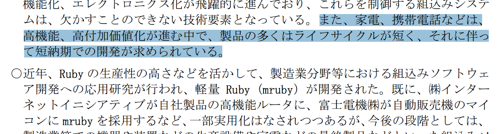
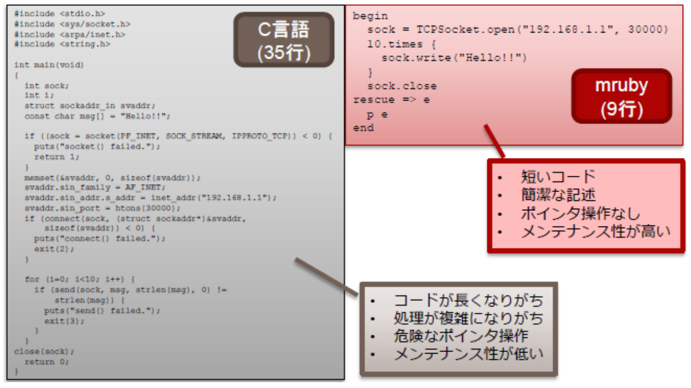
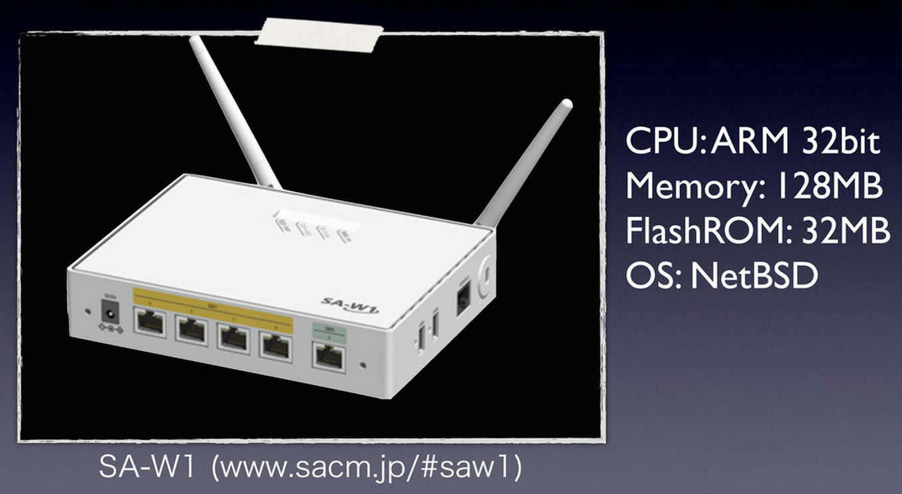

# Embedding mruby into C and an actual example
author
:   P.S.V.R

allotted-time
:   40m

theme
:   debian

# mruby

{:relative_height='80' reflect_ratio='0.5'}

m = _m_ atz' + e _m_ beddable + _m_ inimalistic + _m_ odular

# why mruby?

{:relative_height='100'}

# purpose: boost productivities of embedded dev.

{:relative_height='100'}

# who might be using it?

{:relative_height='80'}

* 富士電機（杭州）軟件有限公司

# who might be using it?

{:relative_height='80'}

* IIJ's router products c.f. https://github.com/iij/mruby

# Actually...

* mruby is not only for the EMBEDDED WORLD
* mruby is for the ENTIRE C WORLD
* just knowing C is enough to get you going, you don't necessarily need embedded devices or EE degrees

# who is also using it?

* `mod_mruby`:

https://github.com/matsumoto-r/mod_mruby

* `ngx_mruby`:

https://github.com/matsumoto-r/ngx_mruby

# who is also using it?

* `php-mruby`:

https://github.com/chobie/php-mruby

* `ab-mruby`:

https://github.com/matsumoto-r/ab-mruby

# who is also using it?

* `go-mruby`:

https://github.com/mitchellh/go-mruby

# "反主为客"

* MRI: 主Ruby 客C
* mruby: 主C 客Ruby

# "反主为客"
* MRI:

only _1_ VM per process, then add features to the VM

* mruby:

_N_ VMs per process, then call VMs from C

# "mrb_state"

* NO GLOBAL VARIABLES, everything are inside "mrb_state"
* refereed to by almost all functions
* [_demo_] see "typedef struct mrb_state"

# why is there no file I/O
* the underlying machine might not have a file system at all
* event STD I/O is configurable
* [_demo_] see "#ifdef ENABLE_STDIO"

# MRI: too much POSIX

...

